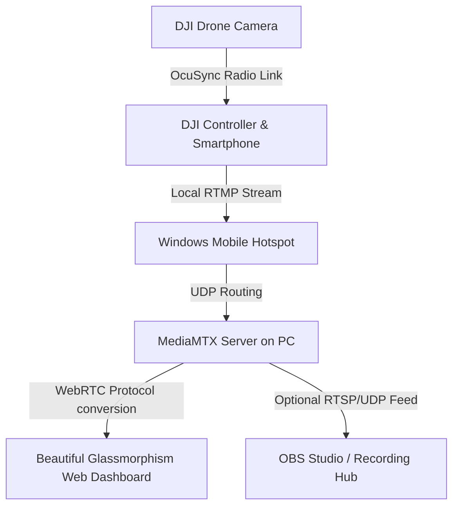

# DJI Low-Latency Live Streaming Hub 🚀

[](LICENSE)
[](https://www.microsoft.com/windows)
[](https://github.com/PowerShell/PowerShell)
[](#)

An automated, **100% offline, local-first** solution designed to stream real-time video from your **DJI Drone** (using the DJI Fly app on your smartphone connected to your controller) directly to a Windows PC with **ultra-low latency (under 300ms delay)**.

By bypassing expensive and delayed cloud processing, it routes the drone's incoming local **RTMP** stream directly over your PC's Wi-Fi hotspot and converts it in real time to the UDP-based **WebRTC** protocol.

---

## 🗺️ How it Works (Architecture Flow)



---

## ✨ Features

* **Ultra-Low Latency (<300ms):** Leverages local WebRTC (UDP) to completely eliminate buffering delays.
* **100% Free & Local-First:** No cloud servers, no paid API keys, no monthly fees, and works without an active internet connection.
* **Automated Hotspot Configuration:** One-click launcher automatically configures the Windows Wi-Fi Direct Mobile Hotspot so your phone can easily connect directly to your PC.
* **Zero-Setup Media Server:** Downloads, extracts, and runs the open-source **MediaMTX** server automatically on first boot.
* **OBS Studio Integration:** Out-of-the-box instructions and URL streams for lag-free recording or RTMP forwarding.
* **Public Tunneling Support:** Built-in `ngrok` script option for cases where you want to stream remotely over the cellular network.

---

## 📁 Repository Structure

* **`compile-launcher.ps1`**: Auto-compiler that packages all files into a single, clean executables `DJI-Stream-Hub.exe`.
* **`start-stream.ps1`**: Main network, Hotspot automation, and MediaMTX server management logic.
* **`dashboard.html`**: A gorgeous dark-mode, glassmorphism web panel that handles the WebRTC player.
* **`mediamtx_template.yml`**: Fine-tuned MediaMTX configuration file optimized for maximum performance.
* **`start-ngrok-stream.ps1`**: Alternative startup script for public remote streams via secure `ngrok` tunneling.
* **`README-pt-BR.md`**: Versão da documentação em Português (Portuguese translation).

---

## 🛠️ Windows Prerequisites

1. **PowerShell 5.1 or superior:** Native in Windows 10/11.
2. **PowerShell Execution Policy:** To safely run local PowerShell scripts:
   * Open **PowerShell as Administrator** and execute:
     ```powershell
     Set-ExecutionPolicy -ExecutionPolicy RemoteSigned -Scope CurrentUser -Force
     ```

---

## ⚡ Step-by-Step Guide

### Step 1: Run the Server on your PC
1. Double-click the **`DJI-Stream-Hub.exe`** launcher (or compile it using `compile-launcher.ps1`).
2. The launcher will:
   * Request **Administrator permissions (UAC elevation)** to enable automatic Hotspot and Firewall configurations.
   * Start the media server (**MediaMTX**) and open the **Glassmorphism Web Dashboard** in your default browser.
3. Keep the terminal window open. It will show your dynamic local RTMP link.

### Step 2: Connect your Smartphone to the PC Network
1. On your Windows PC, toggle the **Mobile Hotspot** on (Wi-Fi tethering).
2. Connect your smartphone (attached to the drone's remote controller) to the Wi-Fi network named **`DJI-Stream-Hub`** (Password: `djidrone123`).
   * *Note: Connecting directly to the PC's hotspot guarantees the lowest possible radio latency.*

### Step 3: Start Live Streaming in DJI Fly
1. Power on your DJI Drone and controller. Launch the **DJI Fly** app and go to the camera view.
2. Tap the **three dots (...)** in the upper right corner.
3. Go to the **Transmission** tab.
4. Tap **Live Streaming Platforms** and select **RTMP**.
5. Enter the RTMP address shown on your Web Dashboard (e.g., `rtmp://192.168.137.1:1935/live/drone`).
6. Select **720p at 3 Mbps** (recommended for the most stable and delay-free stream).
7. Tap **Start Streaming**.

### Step 4: Watch with Zero Lag!
* The Web Dashboard on your PC will automatically detect the stream and load the WebRTC drone feed in real time!
* Tap the **Fullscreen** button to expand the view.

---

## 🎬 OBS Studio Integration

### Method A: Browser Source (Lowest Delay)
1. In OBS Studio, click the **`+`** under Sources and select **Browser**.
2. Set the URL to the WebRTC dashboard link (e.g., `http://127.0.0.1:8889/live/drone`).
3. Set the dimensions to `1920` x `1080`.

### Method B: Media Source (Super Stable RTSP/UDP)
1. Click the **`+`** under Sources and select **Media Source**.
2. Uncheck **Local File**.
3. In the **Input** field, paste: `rtsp://127.0.0.1:8554/live/drone`.
4. In the **Input Options** field, type: `rtsp_transport=udp`.
5. Confirm. The video loads with a minimal 300ms delay.

---

## 🔍 Troubleshooting

* **Firewall Issues:** Ensure you grant Private and Public network access to `MediaMTX` when prompted by Windows Defender.
* **Incorrect IP:** If you use active VPNs, Docker, or WSL adaptors, the script might capture the wrong virtual IP. You can find all valid alternative network IPs on the dashboard's **Diagnostics** tab and manually swap the IP in your RTMP link.
* **Stuttering Video:** If you experience frame drops, lower the bitrate in the DJI Fly app to 720p/3Mbps or bring the remote controller closer to your PC.

---

## 📄 License

This project is licensed under the MIT License. See [LICENSE](LICENSE) for details.
